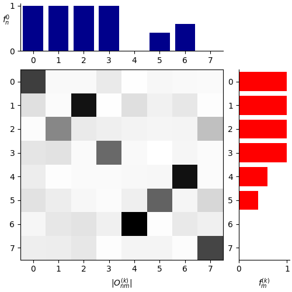

.. _mom:

==============================================================================
Maximum Overlap Method
==============================================================================

Excited-state solutions of the SCF equations are obtained
for non-Aufbau orbital occupations. MOM is a simple strategy to
choose non-Aufbau occupation numbers consistent
with the initial guess for an excited state during
optimization of the wave function, thereby facilitating convergence
to the target excited state and avoiding variational collapse to
lower energy solutions.

The MOM approach implemented in GPAW is the initial maximum
overlap method [#imom]_, where the orbitals
used as initial guess for an
excited-state calculation are taken as fixed reference orbitals.
The GPAW implementation is presented in [#momgpaw1]_
(real-space grid and plane-wave approaches)
and [#momgpaw2]_ (LCAO approach), and supports the
use of fractional occupation numbers.

Excited-state calculations can be difficult
to convergence because excited states
typically correspond to saddle points of the electronic energy surface,
and not minima. The recommended approach to use together with MOM
for calculating excited states is direct optimization (DO) (see :ref:`do`),
which is an alternative to the diagonalization-based
:ref:`eigensolvers <manual_eigensolver>` and is better suited for converging
on saddle points.

~~~~~~~~~~~~~~~~~~~~~~~~~~~~~~~~
Maximizing wavefunction overlaps
~~~~~~~~~~~~~~~~~~~~~~~~~~~~~~~~

Let `\{|\psi^0_{n}\rangle\}` be the set of reference
orbitals with occupation
numbers `f_n^0` and `\{|\psi_{m}^{(k)}\rangle\}` the orbitals
determined at iteration `k` of the wave-function optimization.
The methods aims to find the updated occupation numbers `f_m^{(k)}`
for the orbitals at iteration `k` such to minimize the
electronic distance `\eta` defined as:

.. math::
    \eta = N - \sum_{n m} \bigl|\langle \psi^0_{n} \mid \psi_{m}^{(k)} \rangle\bigr|^2

where `N` is the number of electrons and the summations run over the occupied orbitals only.

Naively, this can be achieved by finding a mapping between the
orbitals using the wavefunction overlap
`O_{nm}^{(k)} = \langle\psi^0_n | \psi_{m}^{(k)}\rangle`, as a measure of their similarity.

.. tip::

    In :ref:`plane-waves<manual_mode>` or :ref:`finite-difference <manual_stencils>`
    modes, the elements of the overlap matrix are calculated from:

    .. math::
        O_{nm}^{(k)} = \langle\tilde{\psi}^0_n | \tilde{\psi}_{m}^{(k)}\rangle +
        \sum_{a, i_1, i_2} \langle\tilde{\psi}^0_n | \tilde{p}_{i_1}^{a}\rangle \left( \langle\phi_{i_1}^{a} | \phi_{i_2}^{a}\rangle -
        \langle\tilde{\phi}_{i_1}^{a} | \tilde{\phi}_{i_2}^{a}\rangle \right) \langle\tilde{p}_{i_2}^{a} | \tilde{\psi}_{m}^{(k)}\rangle

    where `|\tilde{\psi}^0_{n}\rangle` and `|\tilde{\psi}_{m}^{(k)}\rangle`
    are the pseudo orbitals, `|\tilde{p}_{i_1}^{a}\rangle`, `|\phi_{i_1}^{a}\rangle`
    and `|\tilde{\phi}_{i_1}^{a}\rangle` are projector functions, partial
    waves and pseudo partial waves localized on atom `a`, respectively.
    In :ref:`LCAO <lcao>`, the overlaps `O_{nm}^{(k)}` are calculated as:

    .. math::
        O_{nm}^{(k)} = \sum_{\mu\nu} c^{*0}_{\mu n}S_{\mu\nu}c^{(k)}_{\nu m}, \qquad
        S_{\mu\nu} = \langle\Phi_{\mu} | \Phi_{\nu}\rangle +
        \sum_{a, i_1, i_2} \langle\Phi_{\mu} | \tilde{p}_{i_1}^{a}\rangle \left( \langle\phi_{i_1}^{a} | \phi_{i_2}^{a}\rangle -
        \langle\tilde{\phi}_{i_1}^{a} | \tilde{\phi}_{i_2}^{a}\rangle \right) \langle\tilde{p}_{i_2}^{a} | \Phi_{\nu}\rangle

    where `c^{*0}_{\mu n}` and `c^{(k)}_{\nu m}` are the expansion
    coefficients for the initial guess orbitals and orbitals at
    iteration `k`, while `|\Phi_{\nu}\rangle` are the basis functions.

Effectively, we want to find the permutation `\mathcal P` of the updated occupation
numbers such that the sum of the absolute values of the diagonal elements of the overlap matrix is
maximized:

.. math::
    \max_{\mathcal P} \sum_{nm} {\mathcal P} _{nm}\,\bigl|O^{(k)}_{nm}\bigr| = \max_{\mathcal P} \text{Tr} \left( \mathcal P |O^{(k)}| \right) \rightarrow \mathcal P^\max

where `{\mathcal P}_{nm} \in \{0,1\}`. With the matrix representation of the permutation `\mathcal P^\max_{nm}`
the occupation numbers are updated according to:

.. math::
    f_m^{(k)} = \sum_n \mathcal P^\max_{nm} f_n^0

Given the wavefunction overlaps `|O_{nm}^{(k)}|` the optimal permutation can be found using
``scipy.optimize.linear_sum_assignment``. The figure shows the absolute values of the overlap
matrix for a fictional system with 8 bands and the initial occupations `f_n^0`.

From the visual representation of the overlap matrix it is immediately clear
how the updated occupations `f_m^{(k)}` should look like.

~~~~~~~~~~~~~~~~~~~~~~~~~~~~~~~
Maximizing subspace projections
~~~~~~~~~~~~~~~~~~~~~~~~~~~~~~~

An alternative approach consists in maximizing the sum of the projections of the orbitals
onto subspaces of equally occupied reference orbitals, `{s(f_s)}`:

.. math::
    P_{m}^{(k)}(f_s) = \left(\sum_{n \in s}  |O_{nm}^{(k)}|^{2} \right)^{1/2}

where `n \in s` denotes that only orbitals from the subspace
`{s(f_s)}` are taken into account. Thus, one maximizes the sum:

.. math::
    \sum_{m} P_{m}^{(k)}(f_m^{(k)})

If only one subspace of equally occupied orbitals is present, the method is equivalent
to the initial maximum overlap method presented in [#imom]_.

The figure below shows the weight matrices calculated from the overlaps of the above example.
Again, the assignment, which for more than one subspace is done using ``scipy.optimize.linear_sum_assignment``
numerically, can be directly seen in this example case.

.. image:: P_nm_proj.png
   :align: center

~~~~~~~~~~~~~~
How to use MOM
~~~~~~~~~~~~~~

Initial guess orbitals for the excited-state calculation are first
needed. Typically, they are obtained from a ground-state calculation.
Then, to prepare the calculator for a MOM excited-state calculation,
the function ``mom.prepare_mom_calculation`` can be used::

  from gpaw import mom

  mom.prepare_mom_calculation(calc, atoms, f)

where ``f`` contains the occupation numbers of the excited state
(see examples below). Alternatively, the MOM calculation can be
initialized by setting ``calc.set(occupations={'name': 'mom', 'numbers': f}``.
A helper function can be used to create the list of excited-state occupation
numbers::

  from gpaw.directmin.tools import excite
  f = excite(calc, i, a, spin=(si, sa))

which will promote an electron from occupied orbital ``i`` in spin
channel ``si`` to unoccupied orbital ``a`` in spin channel ``sa``
(the index of HOMO and LUMO is 0). For example,
``excite(calc, -1, 2, spin=(0, 1))`` will remove an electron from
the HOMO-1 in spin channel 0 and add an electron to LUMO+2 in spin
channel 1.

The default is to use the subspace projections to assign the occupation numbers.
In order to use the approach of matching the orbitals directly based on
their overlaps, one has to specify::

  mom.prepare_mom_calculation(..., use_projections=False, ...)

.. autofunction:: gpaw.mom.prepare_mom_calculation

..  _h2oexample:

~~~~~~~~~~~~~~~~~~~~~~~~~~~~~~~~~~~~~~~~~~~~~~~~~~~
Excitation energy Rydberg state of water
~~~~~~~~~~~~~~~~~~~~~~~~~~~~~~~~~~~~~~~~~~~~~~~~~~~

In this example, the excitation energies of the singlet and
triplet states of water corresponding to excitation
from the HOMO-1 non-bonding (`n`) to the LUMO `3s` Rydberg
orbitals are calculated.
In order to calculate the energy of the open-shell singlet state,
first a calculation
of the mixed-spin state obtained for excitation within the same
spin channel is performed, and, then, the spin-purification
formula [#spinpur]_ is used: `E_s=2E_m-E_t`, where `E_m` and `E_t` are
the energies of the mixed-spin and triplet states, respectively.
The calculations use the Finite Difference mode to obtain an accurate
representation of the diffuse Rydberg orbital [#momgpaw1]_.

.. literalinclude:: mom_h2o.py

----------
References
----------

.. [#imom]     G. M. J. Barca, A. T. B. Gilbert, P. M. W. Gill
               :doi:`Simple Models for Difficult Electronic Excitations <10.1021/acs.jctc.7b00994>`,
               *J. Chem. Theory Comput.*, **14** 1501-1509 (2018).

.. [#momgpaw1] A. V. Ivanov, G. Levi, H. Jónsson
               :doi:`Method for Calculating Excited Electronic States Using Density Functionals and Direct Orbital Optimization with Real Space Grid or Plane-Wave Basis Set <10.1021/acs.jctc.1c00157>`,
               *J. Chem. Theory Comput.*, (2021).

.. [#momgpaw2] G. Levi, A. V. Ivanov, H. Jónsson
               :doi:`Variational Density Functional Calculations of Excited States via Direct Optimization <10.1021/acs.jctc.0c00597>`,
               *J. Chem. Theory Comput.*, **16** 6968–6982 (2020).

.. [#momgpaw3] G. Levi, A. V. Ivanov, H. Jónsson
               :doi:`Variational Calculations of Excited States Via Direct Optimization of Orbitals in DFT <10.1039/D0FD00064G>`,
               *Faraday Discuss.*, **224** 448-466 (2020).

.. [#spinpur]  T. Ziegler, A. Rauk, E. J. Baerends
               :doi:`On the calculation of multiplet energies by the hartree-fock-slater method <10.1007/BF00551551>`
               *Theoret. Chim. Acta*, **43** 261–271 (1977).
